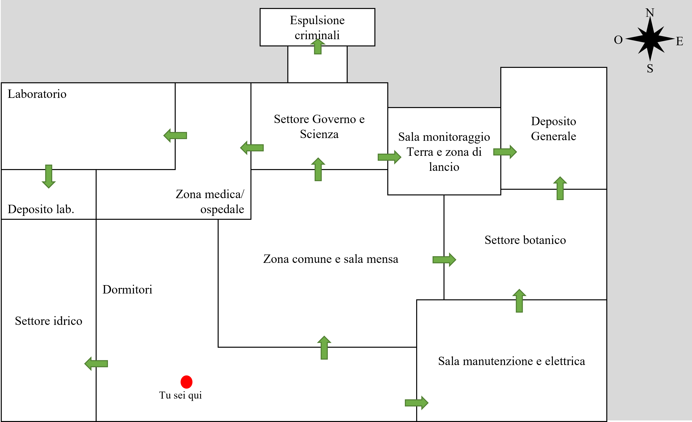

# Ambientazione, Personaggio Principale, Trama e Mappa

## Ambientazione 
**Luogo** Stazione Spaziale denominata `Arca`

**Anno** 2322

---

## Personaggio principale
**Nome** Raven

**Età** 27 anni

**Lavoro** Ingegnere aerospaziale

---

## Trama

Giorno 35.405 sull’Arca. Sono passati 97 anni, da quando la Terza Guerra Mondiale ha distrutto il pianeta Terra a causa dello sgancio di bombe atomiche su gran parte della sua superficie, nessuno sa se sia di nuovo abitabile. È un giorno come tanti altri, tutto trascorre tranquillamente, ieri ho riparato uno dei motori delle navicelle che abbiamo qui in caso di emergenza. Sin dalla tenera età ci insegnano come sopravvivere sulla Terra nel caso in cui si possa tornare laggiù. Siccome l’Arca non è molto grande dobbiamo stare attenti a non superare la capienza massima, per questo i criminali vengono espulsi nel vuoto dello spazio senza tuta.

**FORTE BOATO* **SIRENE CHE SUONANO*

Cos’è stato quel boato? E perché le sirene stanno suonando? È tutto buio tranne qualche luce di emergenza accesa! Forse mi conviene andare nella Sala Elettrica e cercare di capire se c’è qualcosa che si può fare per far ritornare la luce `(Minigioco come in among us (quello dei cavi dove si muore sempre perché gli avversari sono stronzi)).` _Sei riuscito a far tornare la luce_. Devo capire cosa è successo, nella Sezione Governo e Scienza (GO-SCI) c’è il **Computer di Bordo** magari può ricondurmi al problema. 

**COMPUTER RICHIEDE PASSWORD* `(Minigioco come in progress bar (quello del CMD con l’hex code), oppure gli facciamo cercare un badge di qualche dipendente della GO-SCI).`

Sei riuscito ad accedere al pc. Guardando le registrazioni dei minuti precedenti delle telecamere di sicurezza ho scoperto che c’è stata un’esplosione nel Laboratorio che è stato chiuso ermeticamente dalle porte e il Deposito del Laboratorio è stato compromesso, purtroppo gli scienziati ed i dipendenti ai loro interni sono morti. A causa del danno subito sono rimasti solo 30 minuti di autonomia d’ossigeno devo trovare un modo per andarmene prima di morire qui... **Dipendente GO-SCI in fin di vita comunica con te.* Quel dipendente GO-SCI mi ha consegnato il suo badge e consigliato di usare una delle navicelle spaziali per scappare poiché un enorme ammasso di roccia lunare sta per entrare in rotta di collisione con l’Arca, ma purtroppo non posso pilotare la navicella da solo, bisogna essere almeno in due. Quando è andata via la corrente ho sbattuto contro qualcosa e ora sto sanguinando dal braccio, mi conviene andare nella Zona Medica e trovare qualcosa per medicarmi questa ferita. `(Cerca qualcosa con cui medicarsi e si medica e upgrade di qualche punto nella barra salute).` Nella Zona Medica ho trovato un'infermiera spaventata e ferita, la aiuto a riprendersi dallo shock e le dico che dobbiamo scappare dall’Arca, lei accetta di aiutarmi. Prima di partire andiamo a verificare che le navicelle siano ancora utili alla fuga. 

**VI RECATE NELLA ZONA MONITORAGGIO TERRA E ZONA DI LANCIO*

Abbiamo controllato e le navicelle, a livello meccanico, sono tutte ok ma mancano i rifornimenti vari, abbiamo scoperto inoltre che servono due chiavi per avviare i motori di lancio della navicella. Dobbiamo trovarle!

**CONTROLLATE NELLE ZONE GO-SCI E MON. TERRA IN CERCA DELLE CHIAVI*

_Tu e l’infermiera avete trovato le chiavi_. Avete ancora bisogno di fare rifornimento, serve carburante per poter decollare, in più ci vorranno un paio di giorni per arrivare sulla Terra, avete bisogno di cibo e acqua, medicinali vari da portare sulla Terra, indumenti vari ed un contatore Geiger per valutare il livello di radiazioni.

**CERCATE IN GIRO PER LE STANZE DELLA STAZIONE IN CERCA DI RIFORNIMENTI*

_Avete tutto l'occorrente per poter partire_. Manca solo il contatore Geiger che hai trovato nei pressi del Laboratorio, c'è solo un problema è danneggiato. Ci servono un nuovo display ed una batteria.

**VI RECATE NEL DEPOSITO GENERALE E NELLA SALA ELETTRICA E DI MANUTENZIONE IN CERCA DEGLI ULTIMI COMPONENTI*

_Avete TUTTO_. Ora possiamo partire e andarcene di qui!

**INSERITE LE CHIAVI DI AVVIO DEL MOTORE DELLA NAVICELLA* **FORTE ROMBO DI MOTORI* **COMPUTER DI BORDO CHE FA IL COUNTDOWN*

Mi sono appena ricordato che per poter partire serve l'approvazione da parte della Sala Monitoraggio Terra, uno di noi si dovrà sacrificare per permettere all'altro di slavarsi.

### Ending 1

**SI SACRIFICA L'INFERMIERA*

_Sei partito con successo_. Poco dopo lo sgancio dall'Arca l'enorme roccia lunare impatta contro la Stazione Spaziale riducendola ad un cumulo di rottami metallici.
Arrivato sulla Terra monitori il livello di radiazioni e scopri che la Terra è nuovamente abitabile.
Il braccio non guarisce ancora, sembra si stia infettando. Magari l'infermiera avrebbe saputo aiutarmi...

**THE END!*

### Ending 2

**DECIDETE DI RIMANERE ENTRAMBI SULL'ARCA E MORIRE INSIEME*

**THE END!*

---

## Mappa

- Il punto rosso rappresenta il punto di inizio della storia.
- Le frecce verdi inidicano la presenza di porte.

**N.B.: le frecce rappresentano solo la presenza di porte e NON la direzione**